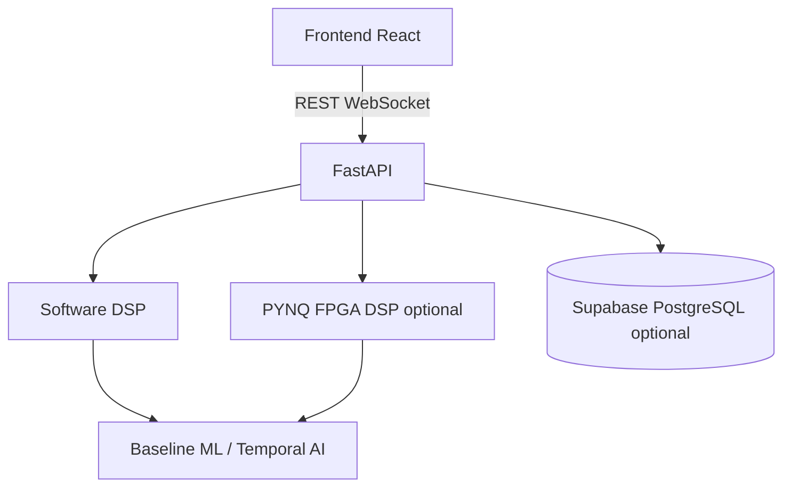

# Architecture

## Software stack

React (Vite) communicates with FastAPI over REST (`/api/*`) and a replay WebSocket (`/ws/ecg-analysis/{record_id}`). FastAPI runs ECG DSP, features, baseline, computational twin, and optional sklearn forecasting. PostgreSQL via Supabase is optional; without credentials the API uses an in-memory store so demonstrations work offline.

## Execution modes

- **SOFTWARE** (default): SciPy FIR / Butterworth pipeline. Always available.
- **PYNQ FPGA**: selected only if `PYNQ_ENABLE` is true, the PYNQ API imports, and a bitstream path exists. Missing hardware returns `hardware_available: false` and continues in software.

## Scientific data flow

ECG → quality → preprocess → R-peaks → RR/HR/HRV and morphology → patient baseline (past window only) → twin state → labelled forecast windows (observation vs horizon) → model if trained.

## Leakage control

Forecast features are computed on `[t - observation, t)`. Labels use events in `(t, t+H]`. Train/test splits are recording-level.
